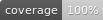

# warmup-api <!-- omit in toc -->

An API for communicating with a wifi-enabled home thermostat made by Warmup.



- [Using this library](#using-this-library)
  - [Installation](#installation)
  - [Usage](#usage)
- [Developing](#developing)
  - [Regenerating the schema](#regenerating-the-schema)
  - [Testing](#testing)

## Using this library

### Installation

Install with:

```sh
npm install --save warmup-api
```

### Usage

Currently, there are only a couple of pieces of functionality available: getting an access token and calling the GraphQL endpoint.

```js
import { getToken, makeGQLQuery } from 'warmup-api';

const token = await getToken('email', 'password'); // Email and password from the user's my.warmup.com account
const getUserProfileQuery = {
  operationName: "getUserProfile",
  query: "query getUserProfile {\n  user {\n    userProfile {\n      email\n      firstName\n      lastName\n    }\n  }\n}",
  variables: null
};
const { data: { user: { userProfile } } } = await makeGQLQuery(getUserProfileQuery, token);
console.log(userProfile.email, userProfile.firstName, userProfile.lastName );
```

The full Warmup GraphQL schema can be found [./warmup-schema.graphql](./warmup-schema.graphql).

## Developing

### Regenerating the schema

The schema, located at [./warmup-schema.graphql](./warmup-schema.graphql) can be regenerated at any time by running (using Node >= 20.x):

```sh
npm run create-warmup-schema
```

This requires the following in a `.env` file which you will need to create:

```sh
USERNAME=""
PASSWORD=""
AUTH_TOKEN=""
```

See the first query in [./http-requests.http](./http-requests.http) for how to obtain an auth token.

### Testing

Run the tests with the usual command:

```sh
npm test
```

This will run the tests with a coverage report (requires 100% across the board to pass), which you can view with:

```sh
open coverage/lcov-report/index.html
```
